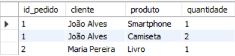

# README - Sistema de Gerenciamento de E-commerce

## Visão Geral
Este projeto consiste em um sistema de banco de dados para gerenciamento de um e-commerce, com tabelas relacionais para clientes, produtos, pedidos e categorias. O sistema permite realizar consultas, atualizar estoques, visualizar relatórios e análises de vendas.

## Estrutura do Banco de Dados

### Tabelas Principais
1. **Categoria** - Armazena categorias de produtos (Eletrônicos, Roupas, Livros)
   
2. **Cliente** - Cadastro de clientes com informações pessoais
   
3. **Produto** - Contém a lista de produtos disponíveis com preços e estoque
   
4. **Pedido** - Registro de pedidos dos clientes
   
5. **ItemPedido** - Itens que compõem cada pedido

### Relacionamentos
- Um cliente pode ter vários pedidos (1:N)
- Um pedido pode conter vários itens (1:N)
- Cada produto pertence a uma categoria (N:1)
- Cada item de pedido referencia um produto (1:1)

## Funcionalidades Principais

### Consultas SQL Implementadas
- Listagem de pedidos com detalhes de clientes e produtos  
  
  
- Relação de produtos por categoria  
  
  
- Cálculo do valor total por pedido  
  
  
- Análise de vendas por categoria  
  
  
- Cálculo da média de valor dos pedidos  
  

### Procedures Armazenadas
- `sp_atualizar_estoque`: Atualiza automaticamente o estoque quando um produto é vendido

### Views Criadas
- `vw_pedidos_em_andamento`: Mostra pedidos com status "Em transporte"
- `vw_produtos_mais_vendidos`: Ranking de produtos por quantidade vendida

### Subconsultas Implementadas
- Clientes que fizeram pedidos com valor total superior a R$100  
  
  
- Produtos com estoque abaixo da média  
  

## Dados de Exemplo Incluídos
O sistema inclui dados iniciais para demonstração:
- 3 categorias (Eletrônicos, Roupas, Livros)
- 2 clientes (João Alves e Maria Pereira)
- 3 produtos (Smartphone, Camiseta, Livro)
- 2 pedidos com status diferentes
- 3 itens de pedido associados

## Como Utilizar
1. Execute o script SQL completo para:
   - Criar o banco de dados e tabelas
   - Inserir os dados iniciais
   - Criar as procedures e views

2. Utilize as consultas de exemplo ou crie novas conforme necessidade

## Relatórios Disponíveis
O sistema permite gerar:
- Total de vendas por categoria
- Média de valor dos pedidos
- Produtos mais vendidos
- Pedidos em andamento
- Clientes com maiores compras

## Requisitos do Sistema
- MySQL Server 5.7 ou superior
- Permissões para criação de banco de dados e procedures